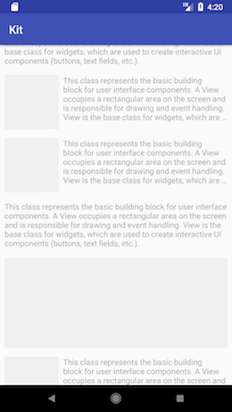

# RecyclerKit

Item kit binding for RecyclerView without Adapter.

Android API 15 And Above.

RecyclerView绑定任意Item组件的依赖注入框架。

 
Sample
-----
 
 
 
 

Quick Start
-----
gradle
```groovy
android {
    ```
    defaultConfig {
        applicationId "YourApplicationId"
        ```
        javaCompileOptions {
            annotationProcessorOptions {
                arguments = [
                        applicationId: applicationId,
                ]
            }
        }
    }
    ```
}

dependencies {
    ```
    implementation 'androidx.recyclerview:recyclerview:1.1.0'
    
    // recycler-kit
    implementation 'com.biubiu.recycler:kit-api:0.0.4'
    implementation 'com.biubiu.recycler:kit-annotation:0.0.4'
    annotationProcessor 'com.biubiu.recycler:kit-compiler:0.0.4'
}
```

Annotation
```java
@Kit(ui = TitleKit.class)
public class Data {
    
}
```

kit
```java
public class TitleKit extends AbsKit {
    
    @Override
    public View getKit(ViewGroup viewGroup) {
        return inflateView(viewGroup, R.layout.item_title);
    }
    
    @Override
    public void bind(int position, Object data) {
        
    }
}

``` 

bind
```java
public class MyActivity extends Activity {
    public void onCreate(Bundle savedInstanceState) {
        super.onCreate(savedInstanceState);
        
        List<Object> list = new ArrayList<>();
        
        list.add(new TitleKit.Data());
        list.add(new CardCoverKit.Data());
        list.add(new CardCoverSmallKit.Data());
        list.add(new CardCoverSmallKit.Data());
        list.add(new CardTextKit.Data());
        list.add(new CardImageKit.Data());
        list.add(new CardCoverSmallKit.Data());
        list.add(new CardCoverSmallKit.Data());
        list.add(new TitleKit.Data());
        list.add(new CardCoverSmallKit.Data());
        list.add(new CardTextKit.Data());
        list.add(new CardImageKit.Data());
        list.add(new CardCoverSmallKit.Data());
        list.add(new CardCoverSmallKit.Data());
        list.add(new BaselineKit.Data());
        
        KitBaseAdapter adapter = new KitBaseAdapter(this, list);
        
        RecyclerView recycler = findViewById(R.id.recycler);
        
        recycler.setLayoutManager(new LinearLayoutManager(this));
        recycler.setAdapter(adapter);
    }
}
 ```
 proguard-rules.pro
 ```groovy
-keep class * implements com.biubiu.kit.core.IKitFactory { *; }
```

## TODO
支持各类LayoutManager。
